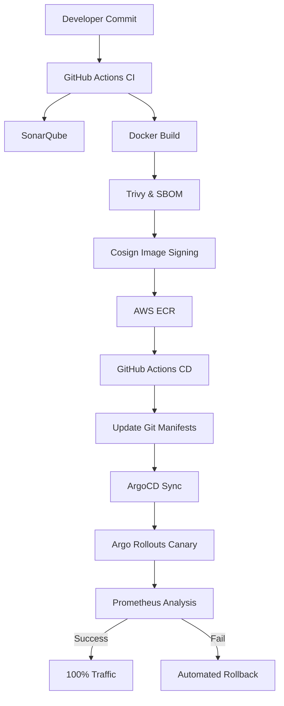
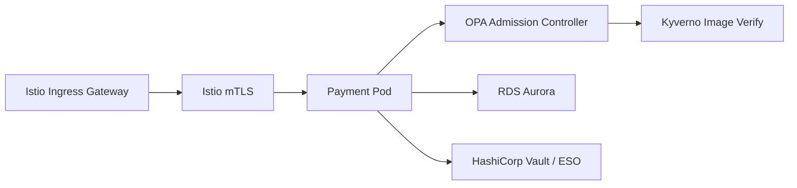

# NovaPay Architecture

## Overall DevSecOps Pipeline Architecture

```mermaid
flowchart TD
    Git[Developer Commit] --> CI[GitHub Actions CI]
    CI --> SAST[SonarQube]
    CI --> Build[Docker Build]
    Build --> Scan[Trivy & SBOM]
    Scan --> Sign[Cosign Image Signing]
    Sign --> Push[AWS ECR]
    Push --> CD[GitHub Actions CD]
    CD --> GitOps[Update Git Manifests]
    GitOps --> Argo[ArgoCD Sync]
    Argo --> Canary[Argo Rollouts Canary]
    Canary --> Prom[Prometheus Analysis]
    Prom -- Success --> Promote[100% Traffic]
    Prom -- Fail --> Rollback[Automated Rollback]
```

## Security Architecture (Zero Trust)

```mermaid
flowchart LR
    Ingress[Istio Ingress Gateway] --> AuthZ[Istio mTLS]
    AuthZ --> Pod[Payment Pod]
    Pod --> OPA[OPA Admission Controller]
    OPA --> Verify[Kyverno Image Verify]
    Pod --> DB[RDS Aurora]
    Pod --> Vault[HashiCorp Vault / ESO]
```
